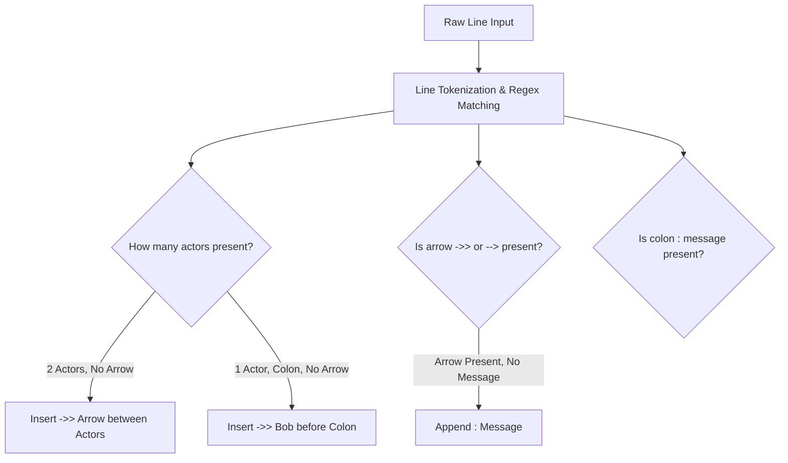
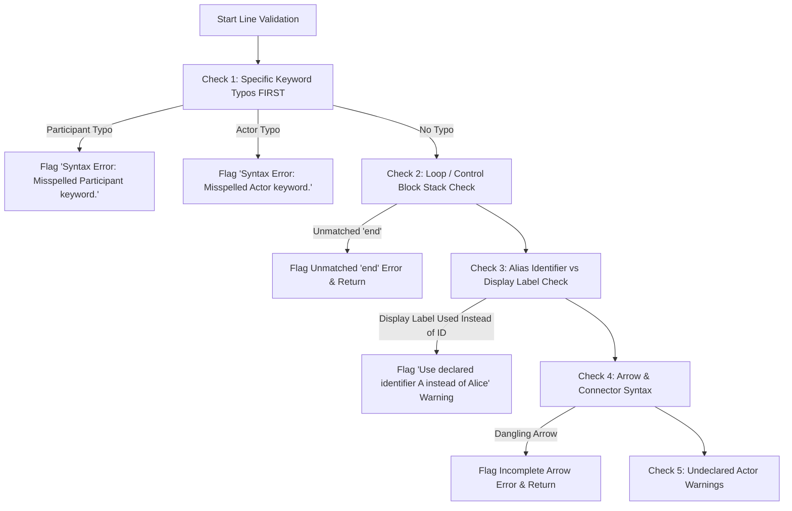

# CodeEditor Diagram Validation Architecture & Algorithm

This document provides a comprehensive, step-by-step breakdown of the validation architecture and algorithms implemented for Mermaid diagrams (`sequenceDiagram`, `flowchart`, `classDiagram`).

---

## 1. Modular Directory Structure

Validation and auto-fix logic are decoupled into dedicated, independent modules in `js/`:

```
d:/Mermaid/js/
├── editor.js                   # Line Gutter, Syntax Error Parsing, Error Bar & Warnings
├── auto-fix.js                 # Auto-Fix Repair & Participant Alias Alignment Engine
├── diagram-types.js            # VALID_DIAGRAM_TYPES & ALLOWED_DIAGRAM_TYPES Engine
└── validators/
    ├── sequence-validator.js   # Sequence Diagram Syntax Diagnostics & Auto-Fix Rules
    ├── flowchart-validator.js  # Flowchart Diagram Syntax Diagnostics & Auto-Fix Rules
    └── class-validator.js      # Class Diagram Syntax Diagnostics & Auto-Fix Rules
```

---

## 2. Line Component Analysis Before Auto-Fixing

Before applying any code fix, `autoFixSequenceCode()` performs a **Line Component Analysis** to inspect what exists in the line and identify what is missing or incorrect:



### Line Analysis & Component Replacement Matrix:

| Line Input State | Detected Components | What Needs To Be Fixed / Added | Fixed Result Output |
|---|---|---|---|
| `participan Alice` | Misspelled `participan` | Replace `participan` → `participant` | `participant Alice` |
| `Alice Bob: Hello` | Actor 1 (`Alice`), Actor 2 (`Bob`), Colon (`: Hello`), ❌ Missing Arrow | Insert `->>` arrow between `Alice` and `Bob` | `Alice ->> Bob: Hello` |
| `Alice: Hello` | Actor 1 (`Alice`), Colon (`: Hello`), ❌ Missing Arrow + Target | Insert `->> Bob` before colon | `Alice ->> Bob: Hello` |
| `Alice ->>` | Actor 1 (`Alice`), Arrow (`->>`), ❌ Missing Target + Message | Append `Bob: Message` | `Alice ->> Bob: Message` |
| `Alice ->> Bob` | Actor 1, Arrow, Actor 2, ❌ Missing Colon + Message | Append `: Message` | `Alice ->> Bob: Message` |
| `Alice->>Bob: Hello`<br>*(with `participant A as Alice`)* | Display Label (`Alice`), ❌ Expected Identifier (`A`) | Replace `Alice` → `A` | `A->>Bob: Hello` |
| `loop Every day`<br>*(at document end)* | Open `loop` block, ❌ Missing closing `end` | Append `end` at bottom of diagram | `end` |

---

## 3. Step-by-Step Validation Algorithm

### Step 1: Document Pre-Processing & Line Extraction
1. Extract document string from text editor (`#source`).
2. Normalize carriage returns (`\r` -> `""`).
3. Split content into an array of lines (`lines = cleanText.split('\n')`).

---

### Step 2: Line 1 Diagram Header Validation
1. Inspect **Line 1** (skipping optional frontmatter YAML `--- ... ---`).
2. Extract the first word (e.g. `sequenceDiagram`, `flowchart`, `classDiagram`).
3. Validate against `VALID_DIAGRAM_TYPES`.
4. **Result**: If header is unrecognized or contains typos (e.g. `sequenceDiagrm`, `flwchart`, `clasDiagram`), attach an **Error Diagnostic** to Line 1:  
   `Syntax Error: Misspelled diagram type "<firstWord>". Expected "sequenceDiagram".`

---

### Step 3: Universal Structural Checks (All Lines)
Before dispatching to diagram-specific validators, scan each line for basic syntax flaws:
1. **Unclosed Quotes**: Count `"` occurrences per line. If odd, flag `Unclosed quote string.`
2. **Unclosed Brackets / Parens**: Check for unclosed `[`, `(`, or `{` at line ends.

---

### Step 4: Sequence Diagram Keyword, Alias & Loop Check Order

Inside `sequence-validator.js`, sequence lines are evaluated in the following strict order:



---

### Step 5: Editor UI, Gutter & Syntax Highlight Overlay Synchronization
1. Diagnostics are passed to [js/editor.js](file:///d:/Mermaid/js/editor.js) `syncGutter()` and `syncLocalHL()`.
2. **Gutter Line Numbers & Block Alignment**:
   - `.gutter-error-line` (bold red background/text) for error lines.
   - `.gutter-warning-line` (bold amber background/text) for warning lines.
   - `.gutter span` line numbers and `.hl-line` syntax overlay rows share identical `display: block`, `height: var(--editor-line-height)`, and `line-height: var(--editor-line-height)` properties so text, active line highlights, error highlights, and gutter numbers scale in 1-to-1 lockstep.
3. **Syntax Highlight Overlay (`#hlLayer`)**:
   - Tokenized via `highlightLine(line, actorColorMap)`.
   - Each line rendered in `<div class="hl-line ${isActive ? 'hl-active-line' : ''} ${isErr ? 'hl-error-line' : ''}">...</div>`.
4. **Bottom Error Bar & Auto-Fix Button**: `showEditorError()` / `showEditorWarnings()` monitors diagnostic count:
   - **If errors/warnings > 0**: Display bottom error bar with diagnostic message and show **Auto-Fix** button.
   - **If errors/warnings = 0**: Immediately hide error bar and hide **Auto-Fix** button.
