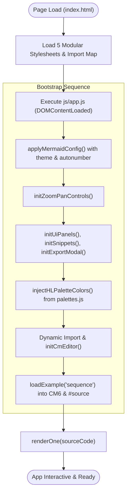
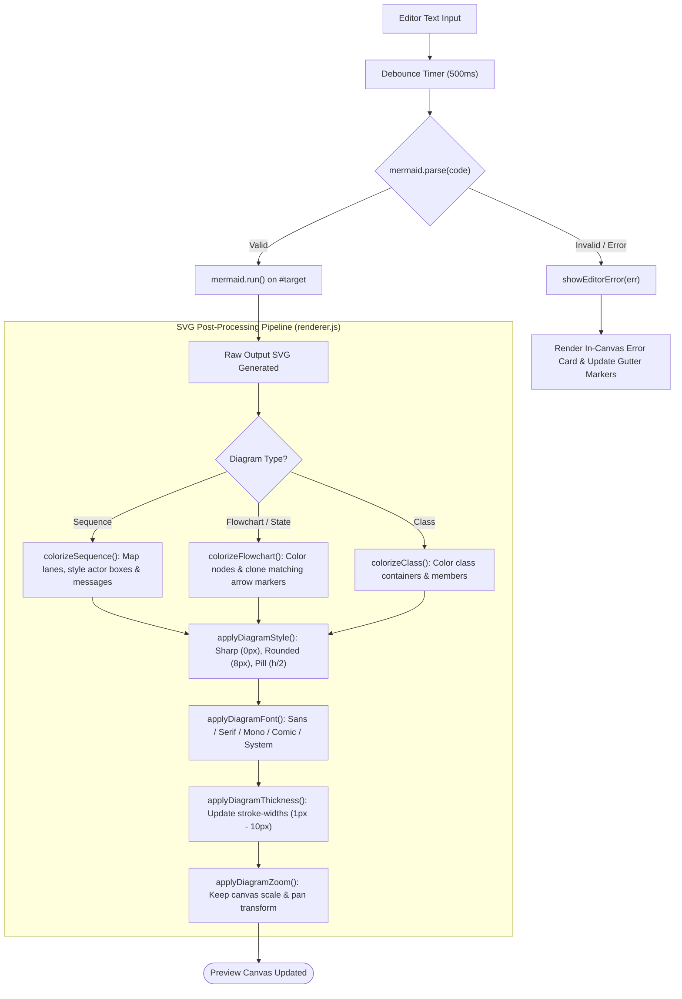
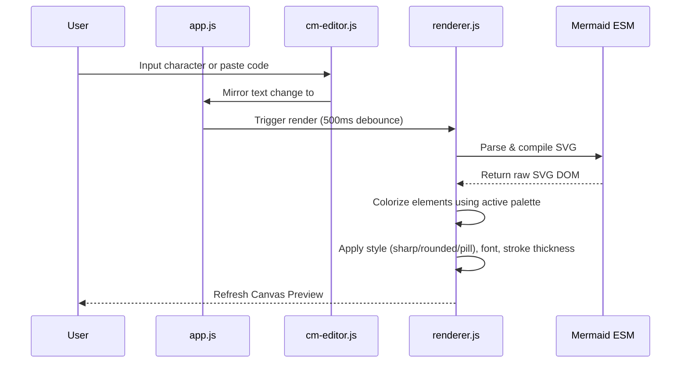
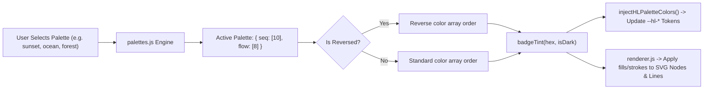
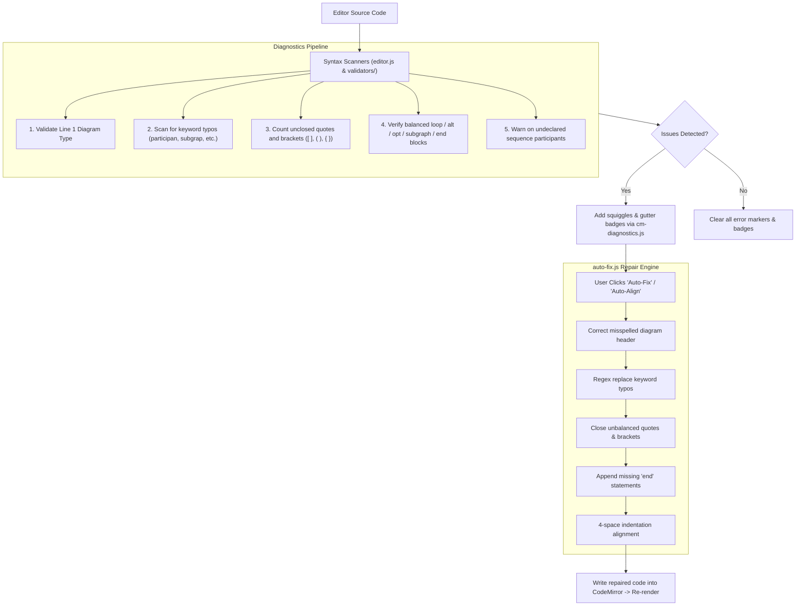
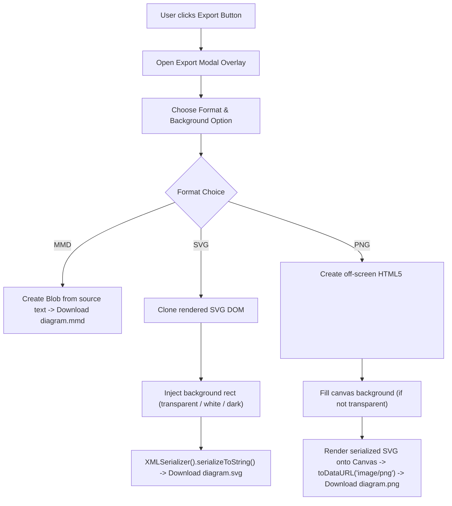

# Mermaid Diagram Explorer — Deep Codebase Analysis & Architecture Report

The **Mermaid Diagram Explorer** is a high-performance, client-side web application designed to serve as an interactive IDE and explorer for **Mermaid 11.16.0** diagrams. Built with vanilla JavaScript, modern modular CSS, and native ES Modules, it operates entirely in the browser with zero build steps, using a minimal Node.js server ([serve.mjs](file:///d:/Thols-Games/serve.mjs)) for static file delivery.

---

## 1. Architectural Overview & Component Structure

```mermaid
graph TD
    Root["Workspace Root: Thols-Games"] --> HTML["index.html"]
    Root --> Server["serve.mjs"]
    Root --> CSS["css/*.css (5 Split Stylesheets)"]
    Root --> JS["js/"]
    Root --> MD["Markdown/ Docs"]
    Root --> Tests["tests/ Playwright Suite"]

    CSS --> MainCSS["main.css"]
    CSS --> ThemeCSS["theme.css"]
    CSS --> EditorCSS["editor.css"]
    CSS --> UICSS["ui.css"]
    CSS --> DiagramCSS["diagram.css"]

    JS --> App["app.js"]
    JS --> CMEditor["cm-editor.js"]
    JS --> CMLang["mermaid-language.js"]
    JS --> CMDeco["cm-decorations.js"]
    JS --> CMDiag["cm-diagnostics.js"]
    JS --> CMAuto["cm-autocomplete.js"]
    JS --> UI["ui.js"]
    JS --> Editor["editor.js"]
    JS --> Renderer["renderer.js"]
    JS --> Palettes["palettes.js"]
    JS --> ZoomPan["zoom-pan.js"]
    JS --> Autofix["auto-fix.js"]
    JS --> DiagramTypes["diagram-types.js"]
    JS --> DiagramsCatalog["diagrams.js"]
    JS --> Validators["validators/"]

    Validators --> SeqVal["sequence-validator.js"]
    Validators --> FlowVal["flowchart-validator.js"]
    Validators --> ClassVal["class-validator.js"]
```

### Application Lifecycle & Bootstrap Flow

### Detailed File Map

| File Path | Purpose |
| :--- | :--- |
| [index.html](file:///d:/Thols-Games/index.html) | Semantic HTML5 structure. Defines layout containers, sidebar panels, controls, import map for CodeMirror 6, and binds ES module entry point. |
| [serve.mjs](file:///d:/Thols-Games/serve.mjs) | Zero-dependency static HTTP server with correct MIME types for `.mjs`, `.js`, `.json`, etc. (serves on port 5505). |
| [package.json](file:///d:/Thols-Games/package.json) | NPM package definition with CodeMirror 6 dependencies and Playwright test runner. |
| [playwright.config.js](file:///d:/Thols-Games/playwright.config.js) | Configuration for Playwright automated E2E tests, auto-starting `serve.mjs`. |
| [css/main.css](file:///d:/Thols-Games/css/main.css) | Core layout styles: preview canvas, top toolbar, export modal, floating actions. |
| [css/theme.css](file:///d:/Thols-Games/css/theme.css) | Design system tokens and themes: dark, teal, and light theme CSS custom properties. |
| [css/editor.css](file:///d:/Thols-Games/css/editor.css) | Code editor styles: CodeMirror host layout, text sizing, gutter markers, active line indicator. |
| [css/ui.css](file:///d:/Thols-Games/css/ui.css) | UI widgets, shape grid drawer, settings panel, theme panel, snippet drawer, tooltips. |
| [css/diagram.css](file:///d:/Thols-Games/css/diagram.css) | Diagram-specific decoration (selection bounding box `#diagram-selection-box`). |
| [js/app.js](file:///d:/Thols-Games/js/app.js) | Main application controller: DOM event bindings, diagram history navigation stack, keyboard shortcuts, Mermaid initialization. |
| [js/cm-editor.js](file:///d:/Thols-Games/js/cm-editor.js) | CodeMirror 6 lifecycle management, runtime compartment reconfiguration (font size, highlight mode), and two-way sync with `#source`. |
| [js/mermaid-language.js](file:///d:/Thols-Games/js/mermaid-language.js) | CodeMirror StreamParser grammar and syntax highlighting styles for Mermaid diagrams. |
| [js/cm-decorations.js](file:///d:/Thols-Games/js/cm-decorations.js) | Inline interactive RGB color swatches / color picker proxy and participant lane coloring in CodeMirror. |
| [js/cm-diagnostics.js](file:///d:/Thols-Games/js/cm-diagnostics.js) | CodeMirror linter integration bridging syntax errors, warnings, and Mermaid parse failures into squiggles and gutter markers. |
| [js/cm-autocomplete.js](file:///d:/Thols-Games/js/cm-autocomplete.js) | CodeMirror autocomplete integration for diagram headers and snippet expansions with tabstops. |
| [js/editor.js](file:///d:/Thols-Games/js/editor.js) | Diagnostics line extraction, sequence warning checks, RGB/Hex math helpers, and participant alias-to-color mapping. |
| [js/renderer.js](file:///d:/Thols-Games/js/renderer.js) | Diagram rendering engine: compiles Mermaid code and executes post-processing SVG colorization, dynamic corner radiuses, font family injection, and stroke thickness. |
| [js/palettes.js](file:///d:/Thols-Games/js/palettes.js) | Color palette engine with 5 categorical palettes (`default`, `sunset`, `ocean`, `forest`, `mono`), palette reversal, and contrast tints. |
| [js/zoom-pan.js](file:///d:/Thols-Games/js/zoom-pan.js) | Viewport controls: drag-panning, wheel zoom, zoom-to-fit, and scale transformation calculations. |
| [js/auto-fix.js](file:///d:/Thols-Games/js/auto-fix.js) | Auto-repair engine: corrects misspelled keywords/types, auto-closes unclosed blocks/quotes/brackets, formats indentation, and aligns sequence aliases. |
| [js/ui.js](file:///d:/Thols-Games/js/ui.js) | UI interactions: side panel drawer toggles, export modal (PNG/SVG/MMD), and bi-directional selection sync. |
| [js/diagram-types.js](file:///d:/Thols-Games/js/diagram-types.js) | Single source of truth for valid vs. allowed diagram types (`VALID_DIAGRAM_TYPES` vs. `ALLOWED_DIAGRAM_TYPES`). |
| [js/diagrams.js](file:///d:/Thols-Games/js/diagrams.js) | Catalog of starter example diagrams. |
| [js/dom.js](file:///d:/Thols-Games/js/dom.js) | Shared DOM utilities, inline style appliers, contrast calculation helpers. |
| [js/validators/](file:///d:/Thols-Games/js/validators/) | Diagram-specific syntax rules and line-by-line validators ([sequence-validator.js](file:///d:/Thols-Games/js/validators/sequence-validator.js), [flowchart-validator.js](file:///d:/Thols-Games/js/validators/flowchart-validator.js), [class-validator.js](file:///d:/Thols-Games/js/validators/class-validator.js)). |

---

## 2. Core Functional Systems

### A. CodeMirror 6 Editor & Syntax Tokenizer
The editor is built on **CodeMirror 6** while maintaining backward-compatible two-way data mirroring with `#source`:
- **Dynamic Runtime Compartments**: [cm-editor.js](file:///d:/Thols-Games/js/cm-editor.js) uses `fontSizeCompartment` and `hlModeCompartment` to dynamically reconfigure font size (10px–24px) and syntax highlighting modes on the fly without tearing down or rebuilding the `EditorView`.
- **StreamLanguage Parser**: [mermaid-language.js](file:///d:/Thols-Games/js/mermaid-language.js) tokenizes keywords, comments (`%%`), strings, numbers, connector arrows (`-->`, `->>`, `-x`, etc.), alias connectors (`as`), and `rgb()`/`rgba()` color literals.
- **Interactive Inline Swatches**: [cm-decorations.js](file:///d:/Thols-Games/js/cm-decorations.js) renders inline `.cm-color-square` swatches for color literals. Clicking a swatch opens a single, off-screen native color input proxy, allowing live color tuning directly inside the code without losing editor focus or breaking open dialogues during document changes.
- **Lane-Synchronized Token Colors**: Sequence diagram participant names in editor code automatically reflect their actual SVG lane colors via `buildAliasColorMap`.

```mermaid
flowchart TD
    subgraph CM6 ["CodeMirror 6 Editor Architecture"]
        Doc["Document State (Text)"] --> StreamParser["mermaid-language.js (StreamLanguage)"]
        StreamParser --> SyntaxTokens["Token Highlighting (Keywords, Strings, Arrows, Comments)"]
        
        Doc --> DecoPlugin["cm-decorations.js (ViewPlugin)"]
        DecoPlugin --> RGBSwatch["Inline Color Squares (.cm-color-square)"]
        DecoPlugin --> LaneColors["Participant Lane Color Matching"]
        
        Doc --> AutoComp["cm-autocomplete.js"]
        AutoComp --> HeaderCompletions["Diagram Header Completion"]
        AutoComp --> BodySnippets["Keyword Snippets with Tabstops"]
        
        Doc --> Linter["cm-diagnostics.js"]
        Linter --> Diagnostics["Lint Gutters & Error Squiggles"]
    end
    
    RGBSwatch -->|Click Swatch| ColorProxy["Off-screen <input type='color'> Proxy"]
    ColorProxy -->|Change Event| UpdateHex["applyRgbColor() writes new hex to CM6 Doc"]
```

---

### B. Diagram Rendering & Post-Processing SVG Engine
Mermaid outputs standard theme SVGs. The explorer applies a custom post-processing pass in [renderer.js](file:///d:/Thols-Games/js/renderer.js):
1. **Compilation**: Invokes `mermaid.parse(text)` followed by `mermaid.run({ nodes: [elTarget] })`.
2. **Colorization**:
   - `colorizeSequence()`: Discovers actor coordinates, assigns palette indices to lifelines and actor boxes, and matches message arrow strokes/labels to source actor colors.
   - `colorizeFlowchart()`, `colorizeClass()`, `colorizeDiagram()`: Injects palette fills and strokes to nodes, shapes, and connecting edges, dynamically creating matching SVG marker arrowheads (`marker-end`, `marker-start`).
3. **Dynamic Style Modifiers**:
   - `applyDiagramStyle()`: Modifies corner radiuses (`rx`, `ry`) across nodes and actors to support `sharp`, `rounded`, and `pill` styles.
   - `applyDiagramFont()`: Injects font families (`sans`, `serif`, `mono`, `comic`, `system`) directly onto all `<text>` and `foreignObject` SVG elements.
   - `applyDiagramThickness()`: Dynamically alters SVG `stroke-width` from 1px to 10px across paths, rectangles, and connectors.

---

### C. Color Palette Subsystem
Centralized in [palettes.js](file:///d:/Thols-Games/js/palettes.js):
- **5 Categorical Palettes**: `default`, `sunset`, `ocean`, `forest`, and `mono`.
- **Palette Reversal**: Allows flipping color order for alternate contrast hierarchies.
- **Contrast Tints**: `badgeTint(hex, isDarkTheme)` calculates adaptive alpha-tinted background colors so that text labels maintain high legibility against filled shapes.

---

### D. Bi-Directional Selection Sync
Implemented in [ui.js](file:///d:/Thols-Games/js/ui.js) and [cm-editor.js](file:///d:/Thols-Games/js/cm-editor.js):
- **Diagram $\rightarrow$ Code**: Clicking an SVG node, actor, or message line calculates its label, finds the matching line in the CodeMirror editor, moves the cursor, and focuses the line.
- **Code $\rightarrow$ Diagram**: Selecting or placing the cursor on an editor line highlights the corresponding diagram node with a green bounding box (`#diagram-selection-box`).

```mermaid
flowchart TD
    subgraph SVGtoCode ["Direction 1: SVG Canvas Click → Code Selection"]
        ClickSVG["User clicks SVG element (node / actor / line)"] --> GetLabel["Extract label text & lane index"]
        GetLabel --> SearchCode["Find matching line in CodeMirror document"]
        SearchCode --> MoveCursor["view.dispatch(selection: { anchor, head })"]
        MoveCursor --> ScrollCM["scrollIntoView: focus editor line"]
    end

    subgraph CodetoSVG ["Direction 2: Code Cursor Movement → SVG Highlighting"]
        CursorMove["User moves cursor / selects line in CodeMirror"] --> ExtractToken["Identify active actor / node identifier"]
        ExtractToken --> QuerySVG["Query SVG element with matching data-lane or label"]
        QuerySVG --> CalcBBox["Compute SVG getBBox() & CTM matrix"]
        CalcBBox --> DrawBox["Position #diagram-selection-box over target SVG node"]
    end
```

---

### E. Diagnostics, Linting & Auto-Fix Engine
- **Linter Bridge**: [cm-diagnostics.js](file:///d:/Thols-Games/js/cm-diagnostics.js) converts line-level syntax issues and warnings into CodeMirror gutter markers and squiggles.
- **Sequence Warnings**: [editor.js](file:///d:/Thols-Games/js/editor.js) / [sequence-validator.js](file:///d:/Thols-Games/js/validators/sequence-validator.js) detect undeclared participants and mismatched block tags.
- **Auto-Fix Engine**: [auto-fix.js](file:///d:/Thols-Games/js/auto-fix.js) automatically:
  - Fixes misspelled header types on Line 1.
  - Fixes common keyword typos (e.g. `participan` $\rightarrow$ `participant`).
  - Balances unclosed double quotes and brackets (`[ ]`, `( )`, `{ }`).
  - Closes unclosed blocks (`loop`, `alt`, `opt`, `par`, `subgraph`, `rect`) with `end`.
  - Auto-formats code indentation (4-space indent) and aligns sequence participant aliases.

---

### F. Viewport & Export Controls
- **Zoom & Pan Engine**: [zoom-pan.js](file:///d:/Thols-Games/js/zoom-pan.js) handles canvas drag-panning, mouse-wheel zooming (20% to 500%), and zoom-to-fit calculations.
- **Export Modal**: [ui.js](file:///d:/Thols-Games/js/ui.js) enables exporting diagrams as high-resolution PNG (with transparent, light, or dark backgrounds), scalable vector SVG, or raw `.mmd` files.

---

## 3. Verification & Testing Infrastructure

The codebase maintains a robust, zero-regression threshold via an end-to-end **Playwright** test suite under `tests/` configured in [playwright.config.js](file:///d:/Thols-Games/playwright.config.js):

- **Command**: `npx playwright test --project=chromium`
- **Feature Suites**:
  - `tests/cm/`: CodeMirror 6 integration, language tokenization, lint diagnostics, font sizing, and autocomplete.
  - `tests/autofix/`: Automated syntax repair, alias normalization, and block closing.
  - `tests/selection-sync/`: Bi-directional SVG $\leftrightarrow$ editor line matching and selection box tracking.
  - `tests/zoom-pan/`: Zoom levels, drag-pan offset computations, and fit-to-screen logic.
  - `tests/theme/`, `tests/snippets/`, `tests/ui/`, `tests/errors/`, `tests/warnings/`: Theme switching, snippet insertions, toolbar actions, and warning badges.
