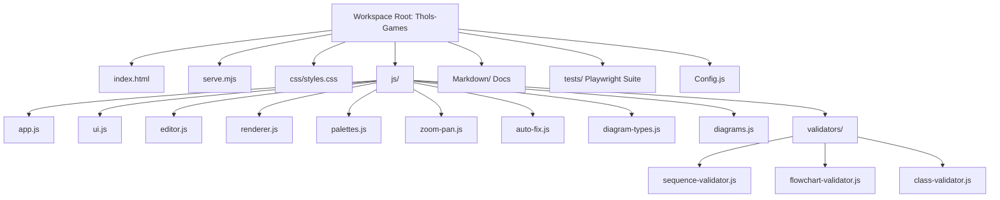
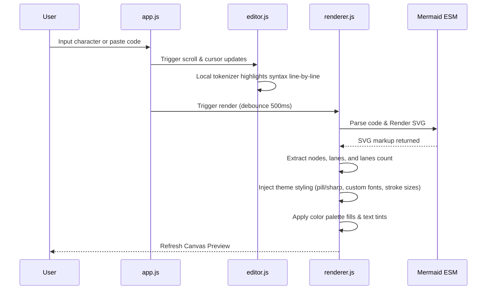

# Mermaid Diagram Explorer — Deep Codebase Analysis & Architecture Report

The **Mermaid Diagram Explorer** is a high-performance, client-side web application designed to serve as an interactive IDE and explorer for **Mermaid 11.16.0** diagrams. Built with vanilla JavaScript, modern CSS, and native ES Modules, it operates entirely in the browser with zero build steps, using a minimal Node.js server (`serve.mjs`) for static file delivery.

This report provides a detailed breakdown of the codebase architecture, its technical components, flow mechanisms, design decisions, and verification suite.

---

## 1. Architectural Overview & Component Structure

The project has a modular, separation-of-concerns architecture dividing the layout, styling, business logic, syntax parsing, and testing layers. Below is the directory tree of the application:

### Detailed File Map

| File Path | Purpose |
| :--- | :--- |
| [index.html](file:///d:/Thols-Games/index.html) | Semantic HTML5 structure. Defines layout containers, sidebar panels, controls, and binds ES module entry point. |
| [Config.js](file:///d:/Thols-Games/Config.js) | Bootstrap script defining global config (`CONFIG.allowedDiagramTypes`) to restrict accessible diagram types. |
| [css/styles.css](file:///d:/Thols-Games/css/styles.css) | Central application stylesheet. Implements responsive CSS Grid layouts, CSS Custom Properties (variables) for dark/light themes, custom editor styles, syntax highlighting classes, and modals. |
| [js/app.js](file:///d:/Thols-Games/js/app.js) | Main entry controller. Coordinates startup, wires DOM event listeners, handles global keyboard shortcuts, initializes Mermaid, and manages diagram history stack. |
| [js/ui.js](file:///d:/Thols-Games/js/ui.js) | UI module managing side panels, snippet drawer, editor autocomplete dropdowns, export actions (SVG/PNG/PDF), and resize handles. |
| [js/editor.js](file:///d:/Thols-Games/js/editor.js) | Textarea-based editor logic. Drives scroll synchronizations, line-number gutter generation, custom syntax highlighting overlays, and token color matching. |
| [js/renderer.js](file:///d:/Thols-Games/js/renderer.js) | Diagram rendering engine. Feeds editor source code to the Mermaid compiler and applies custom colorizers, fonts, styles, and stroke-widths to output SVGs. |
| [js/palettes.js](file:///d:/Thols-Games/js/palettes.js) | Color palette engine containing 5 themes (`default`, `sunset`, `ocean`, `forest`, `mono`) and contrast-friendly badge tints. |
| [js/zoom-pan.js](file:///d:/Thols-Games/js/zoom-pan.js) | Controls drag-panning, mouse-wheel zooming, and canvas scale adjustments (25% to 500%, zoom-to-fit). |
| [js/auto-fix.js](file:///d:/Thols-Games/js/auto-fix.js) | Orchestrates diagram formatting, automatic participant alias normalization, indentation, and syntax repair. |
| [js/diagram-types.js](file:///d:/Thols-Games/js/diagram-types.js) | Defines valid vs. permitted diagram types (`VALID_DIAGRAM_TYPES` vs `ALLOWED_DIAGRAM_TYPES`). |
| [js/diagrams.js](file:///d:/Thols-Games/js/diagrams.js) | Catalog of preset diagrams and template text. |
| [js/validators/](file:///d:/Thols-Games/js/validators/) | Diagram-specific syntax rules and line-by-line validators. Includes [sequence-validator.js](file:///d:/Thols-Games/js/validators/sequence-validator.js), [flowchart-validator.js](file:///d:/Thols-Games/js/validators/flowchart-validator.js), and [class-validator.js](file:///d:/Thols-Games/js/validators/class-validator.js). |

---

## 2. Core Functional Systems

### A. The Code Editor & Highlight Overlay
Since the application uses a native `<textarea id="source">` to maximize performance and cross-platform editing compatibility, it implements a custom syntax-highlighting layer (`#hlLayer`) positioned directly underneath or over the text.
- **Scroll Sync**: Scroll offsets (`scrollTop`, `scrollLeft`) are synchronized instantly between the textarea, the overlay, and the line-number gutter (`#gutter`).
- **Gutter Updates**: [editor.js](file:///d:/Thols-Games/js/editor.js) creates line elements inside the gutter, applying red and yellow markers for syntax errors and warnings.
- **Active Line Highlighter (`#textareaActiveBg`)**: Driven by a single CSS variable `--line-index`. The active highlight line tracks the cursor line precisely, recalculating its position as font size changes (10px–24px) via the text slider.
- **Token Color Sync**: In sequence diagrams, participant names/aliases are detected in real-time. The editor builds a map (`buildAliasColorMap`) and colors corresponding participant identifiers in the source code to match the actual SVG node fill colors.

### B. Rendering & Custom Post-Processing SVG Engine
Mermaid's default rendering outputs standard theme-based SVGs. The explorer extends this by running a post-processing pass in [renderer.js](file:///d:/Thols-Games/js/renderer.js#L330-L347) immediately after compilation:
1. **Compilation**: Invokes `mermaid.parse(text)` and `mermaid.run({ nodes: [elTarget] })`.
2. **Colorization**:
   - `colorizeSequence()`: Extracts lane information, colors sequence rectangles and actor titles using the active palette, and colors message lines/text to map to source participant colors.
   - `colorizeClass()`, `colorizeFlowchart()`, `colorizeDiagram()`: Traverse SVG element groups (`g.classGroup`, `g.node`, `g.stateGroup`) and modify child shape fills/strokes inline.
3. **Style Applications**:
   - `applyDiagramStyle()`: Modifies corner radiuses (`rx`, `ry`) of SVG nodes to render `sharp`, `rounded`, or `pill` shapes.
   - `applyDiagramFont()`: Injects custom font families (`sans`, `serif`, `mono`, `comic`, `system`) directly onto all `<text>` and `foreignObject` tags.
   - `applyDiagramThickness()`: Alters SVG `stroke-width` values across paths, rectangles, and connectors (ranging from 1px to 10px).

### C. Color Palette Subsystem
Color handling is centralized in [palettes.js](file:///d:/Thols-Games/js/palettes.js). It provides 5 palettes:
* `default`: Cool teal, slate, and gray tones.
* `sunset`: Warm peach, orange, and coral shades.
* `ocean`: Deep blues, turquoise, and sky colors.
* `forest`: Sage, olive, and forest greens.
* `mono`: Clean grayscale tones.

The palette engine provides helpers such as `badgeTint(hex, isDarkTheme)` to apply appropriate background opacities/tints to labels and boxes so that text remains highly legible against filled backdrops.

### D. Bi-Directional Selection Sync
A premium feature of this explorer is click-based selection sync implemented in [ui.js](file:///d:/Thols-Games/js/ui.js).
* **SVG $\rightarrow$ Editor**: Clicking on an actor box, sequence message line, or flowchart node in the preview canvas extracts the label or actor string. It searches the editor code for the definition or line of that element, shifts the cursor to that line, and highlights the editor line.
* **Selection Box**: An SVG highlight box (`#diagram-selection-box`) is drawn dynamically over selected SVG nodes to indicate focal elements in the preview pane.

### E. Zoom, Pan, & Drag Controls
Built inside [zoom-pan.js](file:///d:/Thols-Games/js/zoom-pan.js), the canvas viewport is highly responsive:
- **Drag Pan**: Left-clicking and dragging the mouse across the canvas pans the viewport (`panX`, `panY`).
- **Scroll Wheel**: Zooming zooms towards the cursor position using transform scales (`zoomScale`) between 0.25 and 5.0.
- **Auto-Fit**: Recalculates canvas boundaries and scales the diagram to fit perfectly inside the preview panel on load.

---

## 3. Diagnostics & Auto-Fix Engine

When Mermaid compilation fails, the system provides high-fidelity, user-friendly diagnostics:
1. **Error Extraction**: `extractErrorLineNumber()` parses error logs to isolate the exact failing line.
2. **Comprehensive Scans**: `findAllErrorLines()` scans the editor document for common syntax issues:
   - Invalid diagram types on Line 1.
   - Unclosed strings (`"`).
   - Trailing connector lines.
   - Unbalanced brackets (`[ ]`, `( )`, `{ }`).
3. **Sequence Warnings**: `checkSequenceDiagramWarnings()` verifies if participants used in message arrows have been formally declared.
4. **Auto-Fix (Auto-Repair)**:
   - Repairs common typos in keywords (e.g. `participan` $\rightarrow$ `participant`).
   - Automatically wraps unclosed strings/brackets at the end of lines.
   - Restores missing target nodes on dangling arrows.
5. **Auto-Alignment**: Formats indentation cleanly (`4 spaces` indent for sub-blocks) and syncs alias parameters in sequence diagrams.

---

## 4. Verification & Testing Infrastructure

The codebase maintains a robust, zero-regression threshold via an end-to-end **Playwright** test suite located in the `tests/` directory.

### Test Categories
* `tests/autofix/`: Verifies participant alignment, brackets, quotes, and keyword correction.
* `tests/editor/`: Validates local tokenizer highlights, line counts, text size scaling, and scrolls.
* `tests/errors/`: Confirms line-specific gutter error highlights, parsing failure reports, and recovery.
* `tests/loops/`: Tests rendering loops and complex flowchart arrows.
* `tests/selection-sync/`: Checks bi-directional SVG to editor line matching and green highlight positioning.
* `tests/snippets/`: Evaluates snippet grid insertions.
* `tests/theme/`: Confirms palette buttons, light/dark modes, and reversed colors.
* `tests/ui/`: Verifies settings panels, sliders, document buttons, copy functionality, and export modal menus.
* `tests/warnings/`: Checks for undeclared participant warning displays in the error bar.
* `tests/zoom-pan/`: Validates drag-pans, zoom buttons (+/-), and fitting algorithms.

All **43 out of 43 tests pass 100% green** on Chrome, Firefox, and Safari (Webkit).

---

## 5. Summary of Architectural Strengths

1. **Lightweight & High Performance**: Zero frame overhead. Using direct DOM queries and vanilla JS ensures near-instant startup speeds and typing feedback.
2. **Resilient Gutter Design**: Overlaying syntax highlights directly on a native textarea offers high performance and native keybindings without complex editor dependency packages.
3. **Decoupled Visual Styles**: Theme adjustments, font swaps, and thickness properties are applied dynamically to SVG DOM attributes instead of requiring compilation roundtrips.
