# Mermaid Cheatsheet

## Table of Contents

- [What Is Mermaid?](#what-is-mermaid)
- [Why Use Mermaid in a Technical Blog?](#why-use-mermaid-in-a-technical-blog)
- [Mermaid Quickstart](#mermaid-quickstart)
- [Basic Markdown Usage](#basic-markdown-usage)
- [Test Diagrams Before Publishing](#test-diagrams-before-publishing)
- [Flowchart Syntax](#flowchart-syntax)
- [Basic Flowchart](#basic-flowchart)
- [Flowchart Directions](#flowchart-directions)
- [Common Node Shapes](#common-node-shapes)
- [Flowchart Arrows](#flowchart-arrows)
- [Subgraphs](#subgraphs)
- [Sequence Diagram Syntax](#sequence-diagram-syntax)
- [Common Sequence Arrows](#common-sequence-arrows)
- [Activation Bars](#activation-bars)
- [Alternatives and Conditions](#alternatives-and-conditions)
- [Class Diagram Syntax](#class-diagram-syntax)
- [Class Relationships](#class-relationships)
- [State Diagram Syntax](#state-diagram-syntax)
- [Entity Relationship Diagram Syntax](#entity-relationship-diagram-syntax)
- [ER Relationship Markers](#er-relationship-markers)
- [Gantt Chart Syntax](#gantt-chart-syntax)
- [Timeline Syntax](#timeline-syntax)
- [Pie Chart Syntax](#pie-chart-syntax)
- [Git Graph Syntax](#git-graph-syntax)
- [Mermaid Cheatsheet](#mermaid-cheatsheet)
- [Diagram Types](#diagram-types)
- [Flowchart Basics](#flowchart-basics)
- [Flowchart Shapes](#flowchart-shapes)
- [Sequence Diagram Basics](#sequence-diagram-basics)
- [Sequence Blocks](#sequence-blocks)
- [Class Diagram Basics](#class-diagram-basics)
- [State Diagram Basics](#state-diagram-basics)
- [ER Diagram Basics](#er-diagram-basics)
- [Comments](#comments)
- [Using Mermaid in Hugo](#using-mermaid-in-hugo)
- [Mermaid Best Practices](#mermaid-best-practices)
- [Keep Diagrams Small](#keep-diagrams-small)
- [Prefer Multiple Small Diagrams](#prefer-multiple-small-diagrams)
- [Use Stable Names](#use-stable-names)
- [Label Important Arrows](#label-important-arrows)
- [Avoid Clever Syntax](#avoid-clever-syntax)
- [Quote Labels When Needed](#quote-labels-when-needed)
- [Think About Dark Mode](#think-about-dark-mode)
- [Common Mermaid Mistakes](#common-mermaid-mistakes)
- [Mistake 1: Too Much Detail](#mistake-1-too-much-detail)
- [Mistake 2: Long Labels](#mistake-2-long-labels)
- [Mistake 3: Unclear Direction](#mistake-3-unclear-direction)
- [Mistake 4: Treating Mermaid as a Design Tool](#mistake-4-treating-mermaid-as-a-design-tool)
- [Mermaid SEO Tips for Technical Blogs](#mermaid-seo-tips-for-technical-blogs)
- [Copy-Paste Mermaid Examples](#copy-paste-mermaid-examples)
- [API Request Flow](#api-request-flow)
- [CI Pipeline](#ci-pipeline)
- [Publishing Workflow](#publishing-workflow)
- [Simple Data Model](#simple-data-model)
- [When Not to Use Mermaid](#when-not-to-use-mermaid)
- [Final Thoughts](#final-thoughts)


Mermaid is a text-based diagramming tool for people who would rather write diagrams than drag boxes around a canvas.

It uses a Markdown-like syntax to describe flowcharts, sequence diagrams, class diagrams, state machines, timelines, Gantt charts, entity relationship diagrams, and more.

For a technical blog, Mermaid is a very good default. The diagrams live next to the article, they can be reviewed in Git, and they are easy to update when the system changes. Static image diagrams look nice until the first architecture change. Mermaid diagrams are not perfect, but they age much better.

This guide is a practical Mermaid quickstart and cheatsheet for developers, technical writers, and Hugo site owners. It is part of the [Documentation Tools in 2026: Markdown, LaTeX, PDF & Printing Workflows](https://www.glukhov.org/documentation-tools/) hub.

## What Is Mermaid?

Mermaid is a diagram-as-code syntax. You write a small text block, and Mermaid renders it as a diagram.

A basic Mermaid diagram looks like this:

this code:

```text
flowchart TD
    A[Write Markdown] --> B[Add Mermaid block]
    B --> C[Render page]
    C --> D[Publish diagram]
```

Is producing diagram:

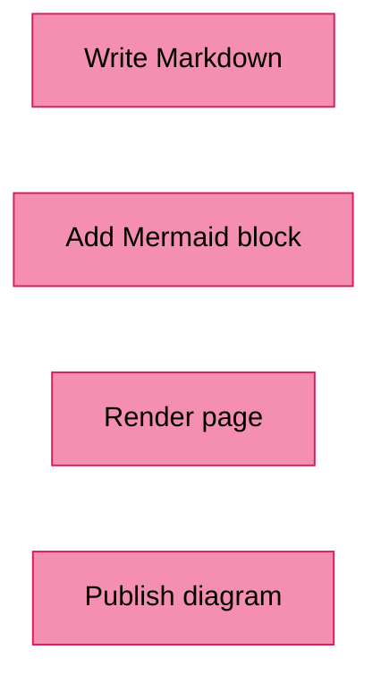

> [!NOTE]
> The important idea is simple: the source of the diagram is plain text. That makes it searchable, reviewable, portable, and easy to keep with the documentation it explains.

## Why Use Mermaid in a Technical Blog?

> [!IMPORTANT]
> Mermaid is useful when your article needs more than prose but less than a full design tool.

Use Mermaid when you want to explain:

- Request and response flows

- Deployment pipelines

- Service dependencies

- State transitions

- Database relationships

- User journeys

- Build steps

- Decision logic

- Project timelines

I would not use Mermaid for every visual. Screenshots, hand-drawn architecture sketches, and polished marketing diagrams still have their place. But for engineering documentation, Mermaid is often the most maintainable option.

## Mermaid Quickstart

### Basic Markdown Usage

In Markdown, use a fenced code block with mermaid as the language:

```text
flowchart TD
    A[User opens website] --> B{Is user logged in?}
    B -->|Yes| C[Show dashboard]
    B -->|No| D[Show login page]
```

Is producing diagram:

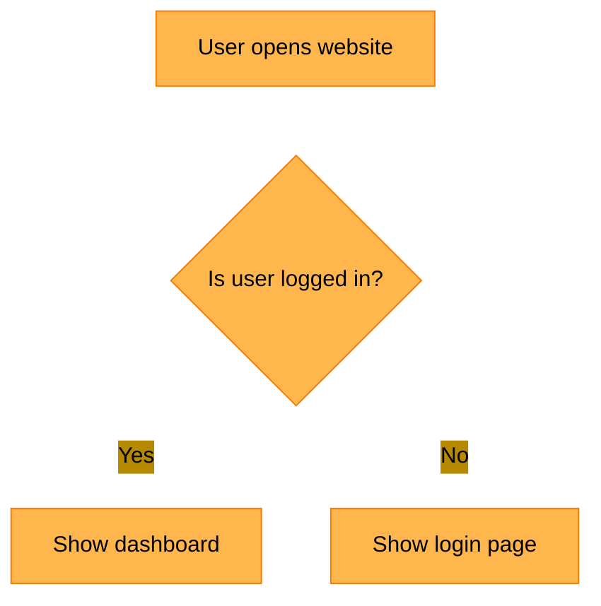

### Flowchart Directions

Mermaid flowcharts support several directions:

```text
flowchart LR
    Browser --> CDN
    CDN --> WebServer
    WebServer --> Database
```

Is producing diagram:

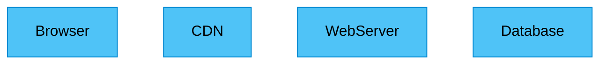

For blog articles, LR is often easier to read for architecture diagrams. For step-by-step processes, TD is usually better.

### Common Node Shapes

this code:

```text
flowchart TD
    A[Rectangle]
    B(Rounded rectangle)
    C{Decision}
    D((Circle))
    E[(Database)]
    F[[Subroutine]]
```

Is producing diagram:

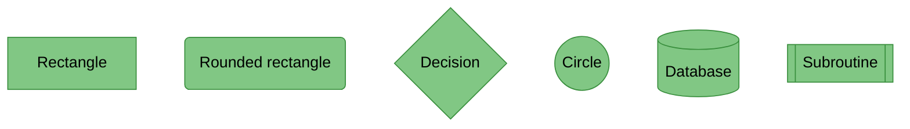

### Flowchart Arrows

this code:

```text
flowchart LR
    A --> B
    B --- C
    C -.-> D
    D ==> E
    E -- Label --> F
```

Is producing diagram:

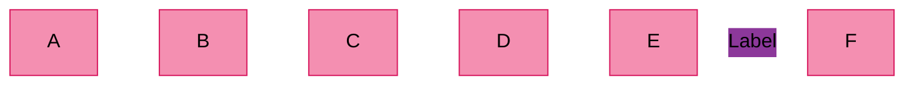

### Subgraphs

Use subgraphs to group related parts of a system.

this code:

```text
flowchart LR
    subgraph Client
        Browser
    end

    subgraph Backend
        API
        Worker
    end

    subgraph Storage
        DB[(PostgreSQL)]
        Cache[(Redis)]
    end

    Browser --> API
    API --> DB
    API --> Cache
    API --> Worker
```

Is producing diagram:

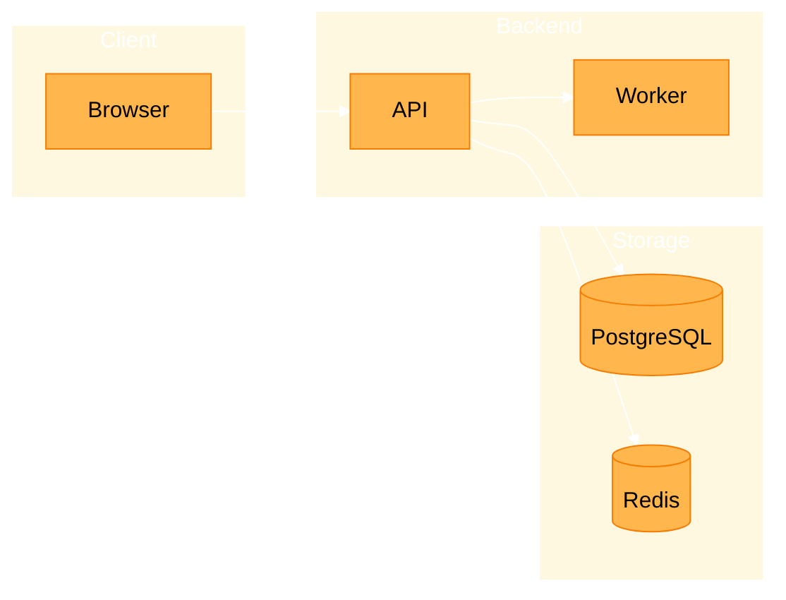

Subgraphs are powerful, but use them carefully. A diagram with six subgraphs and twenty arrows is usually a sign that the article needs two smaller diagrams.

## Sequence Diagram Syntax

Sequence diagrams show communication between actors or services over time.

this code:

```text
sequenceDiagram
    participant User
    participant App
    participant API
    participant DB

    User->>App: Click login
    App->>API: POST /login
    API->>DB: Validate credentials
    DB-->>API: User record
    API-->>App: Access token
    App-->>User: Show dashboard
```

Is producing diagram:

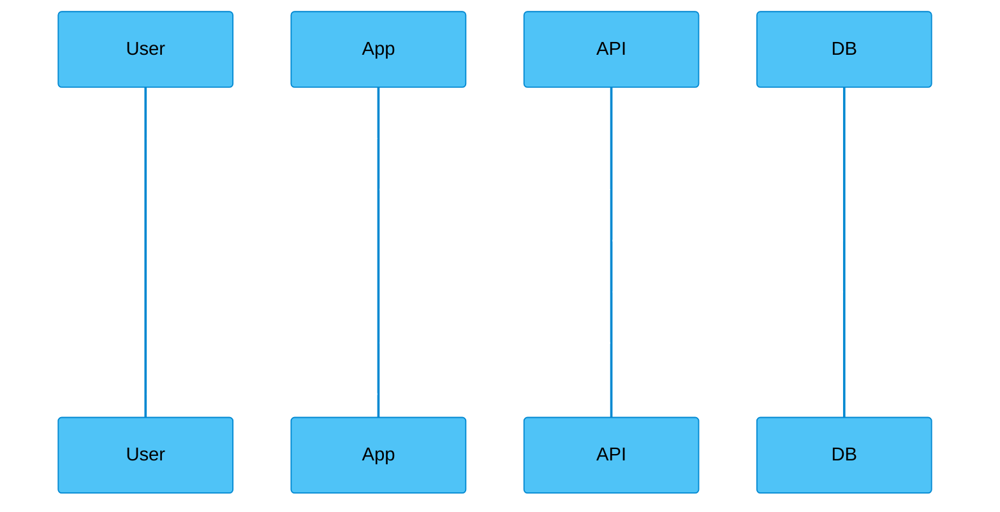

### Common Sequence Arrows

```text
sequenceDiagram
    participant Client
    participant Server

    Client->>Server: Request data
    activate Server
    Server-->>Client: Response
    deactivate Server
```

Is producing diagram:

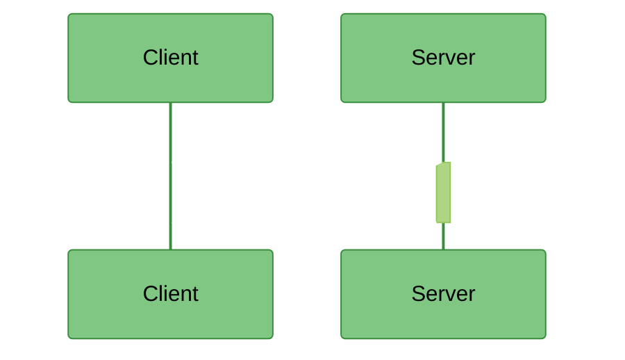

### Alternatives and Conditions

this code:

```text
sequenceDiagram
    participant User
    participant API
    participant Payment

    User->>API: Submit order

    alt Payment succeeds
        API->>Payment: Charge card
        Payment-->>API: Approved
        API-->>User: Order confirmed
    else Payment fails
        Payment-->>API: Declined
        API-->>User: Show error
    end
```

Is producing diagram:

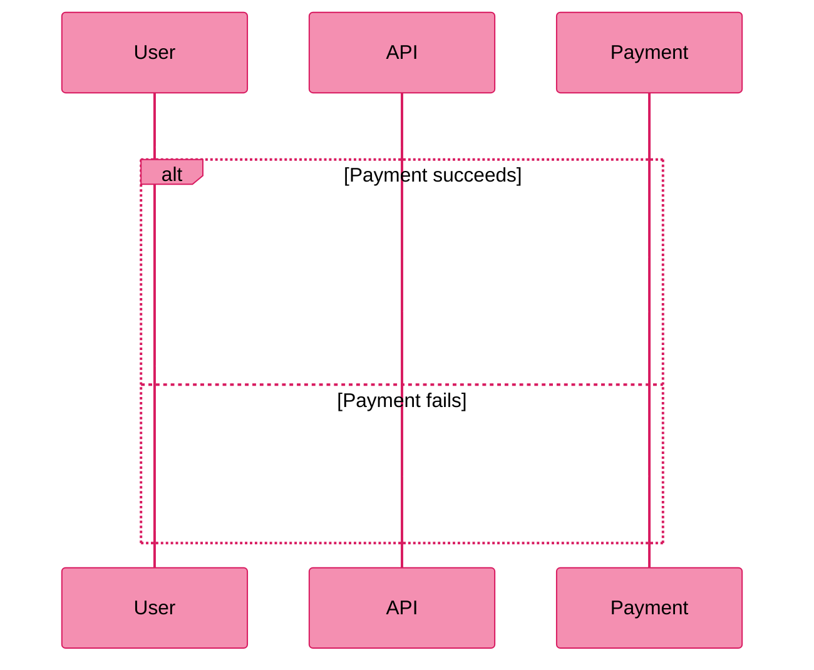

Sequence diagrams are excellent for API articles. They show not just what components exist, but how they talk to each other.

## Class Diagram Syntax

Class diagrams are useful for domain models and object relationships.

this code:

```text
classDiagram
    class User {
        +string id
        +string email
        +login()
        +logout()
    }

    class Order {
        +string id
        +float total
        +submit()
    }

    User "1" --> "*" Order
```

Is producing diagram:

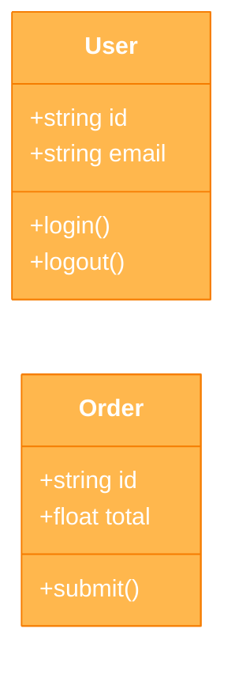

### Class Relationships

```text
classDiagram
    Animal <|-- Dog
    Animal <|-- Cat
    User "1" --> "*" Order
    Order *-- OrderItem
```

Is producing diagram:

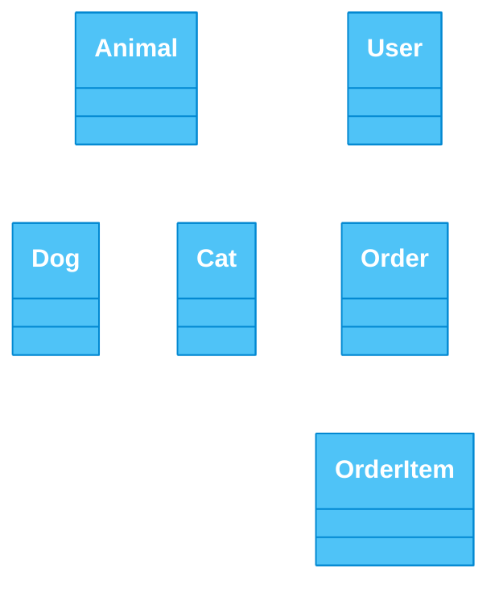

Class diagrams can become noisy fast. In a blog post, prefer a small domain slice over a full application model.

## State Diagram Syntax

State diagrams explain how something changes over time.

this code:

```text
stateDiagram-v2
    [*] --> Draft
    Draft --> Review: submit
    Review --> Published: approve
    Review --> Draft: request changes
    Published --> Archived: archive
    Archived --> [*]
```

Is producing diagram:

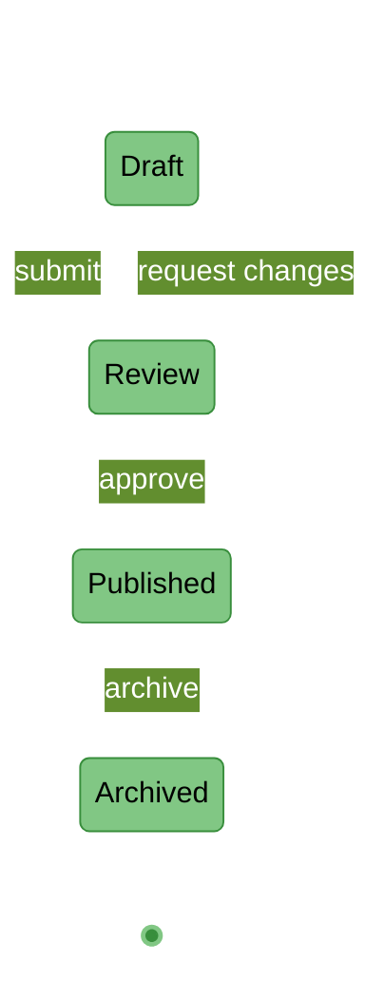

Use state diagrams for:

- Order lifecycles

- Deployment states

- Authentication flows

- Background job status

- Content publishing workflows

State diagrams are underrated. They often explain business logic better than a long paragraph.

## Entity Relationship Diagram Syntax

Entity relationship diagrams are useful for database models.

this code:

```text
erDiagram
    USER ||--o{ ORDER : places
    ORDER ||--|{ ORDER_ITEM : contains
    PRODUCT ||--o{ ORDER_ITEM : appears_in

    USER {
        string id
        string email
    }

    ORDER {
        string id
        datetime created_at
    }

    PRODUCT {
        string id
        string name
    }
```

Is producing diagram:

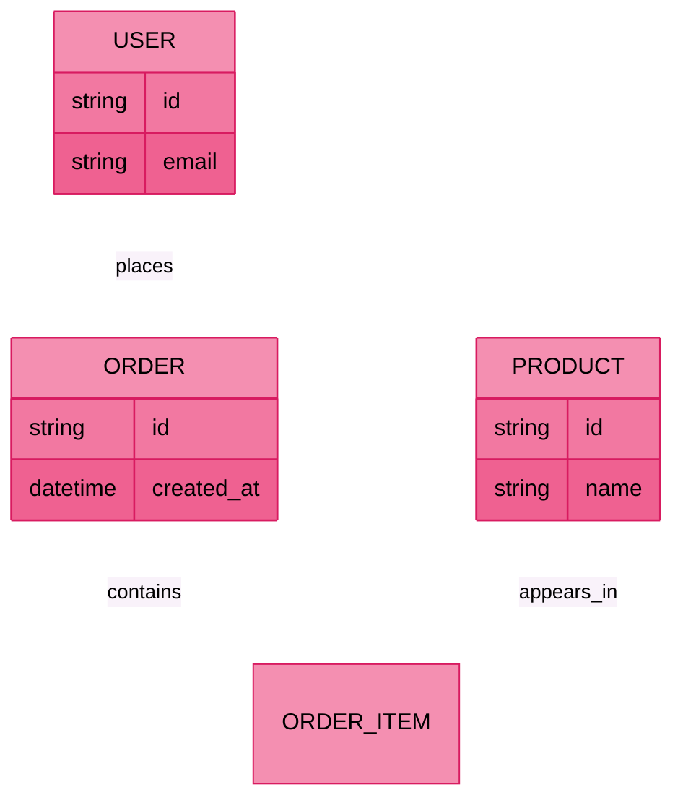

### ER Relationship Markers

```text
gantt
    title Documentation Migration Plan
    dateFormat  YYYY-MM-DD

    section Planning
    Audit current docs      :a1, 2026-06-01, 5d
    Define structure        :a2, after a1, 3d

    section Writing
    Rewrite guides          :b1, after a2, 10d
    Review and publish      :b2, after b1, 4d
```

Is producing diagram:

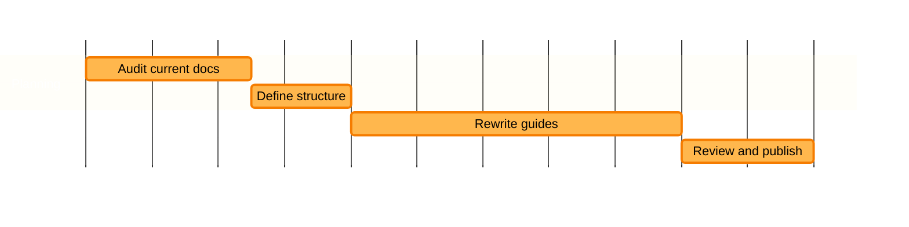

Gantt charts are helpful in internal planning posts, but they can age quickly. Use them when the timeline itself is the point.

## Timeline Syntax

Timelines are good for release histories, incident writeups, and project summaries.

this code:

```text
timeline
    title API Evolution
    2024 : REST API launched
    2025 : Webhooks added
    2026 : Event streaming introduced
```

Is producing diagram:

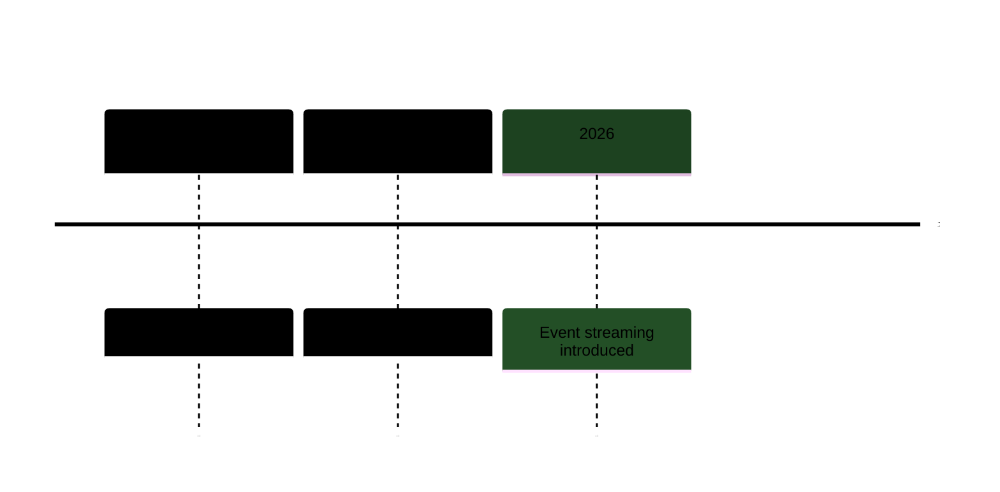

Use a timeline when order matters more than dependency. If what you care about is the sequence of events rather than how they causally connect, a timeline keeps the focus where it belongs and stays easy to read at a glance.

## Pie Chart Syntax

Pie charts are supported, but be careful. They are easy to read when there are only a few categories and the values are clearly different.

this code:

```text
pie title Build Time by Step
    "Install dependencies" : 35
    "Run tests" : 45
    "Build assets" : 20
```

Is producing diagram:

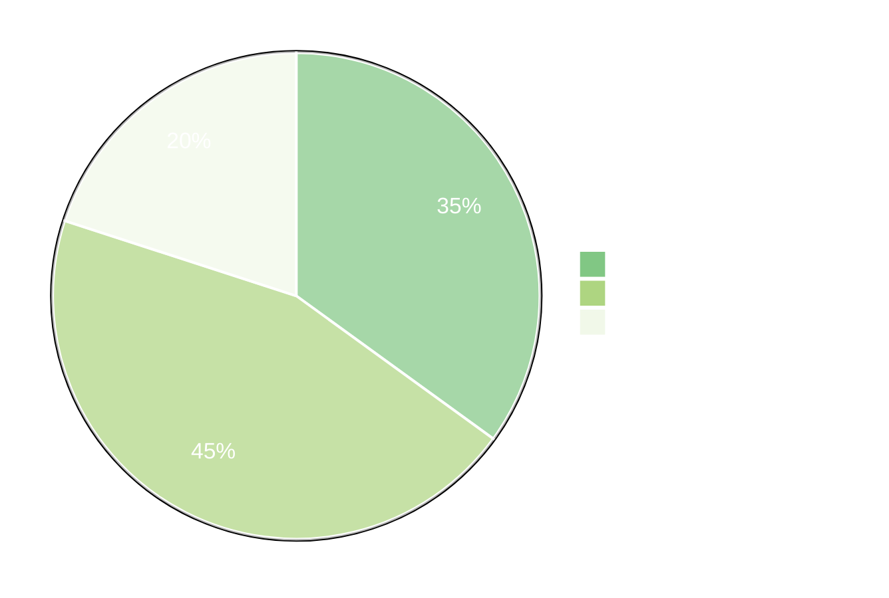

Opinionated advice: if the values are close or there are more than five categories, use a table instead. A well-formatted table communicates precise numbers more honestly than a pie chart where the slices look nearly identical.

## Git Graph Syntax

Git graphs can explain branching strategies and release flows.

this code:

```text
gitGraph
    commit
    branch feature
    checkout feature
    commit
    commit
    checkout main
    merge feature
    commit
```

Is producing diagram:

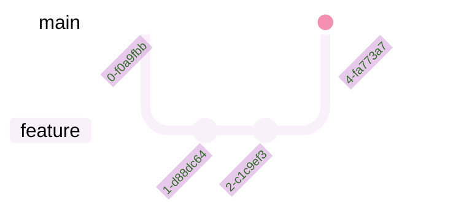

This is useful for articles about Git workflows, trunk-based development, release branches, and hotfixes. If you need a quick reference for the underlying branching commands, the [GIT Cheatsheet](https://www.glukhov.org/developer-tools/git-and-forges/git-cheatsheet/) covers the most common ones alongside merge and rebase workflows.

## Mermaid Cheatsheet

### Diagram Types

```text
flowchart TD
    %% This is a comment
    A --> B
```

Is producing diagram:

```mermaid
%%{init: {'theme': 'base', 'themeVariables': { 'primaryColor': '#ffb74d', 'primaryTextColor': '#000', 'primaryBorderColor': '#f57c00', 'secondaryColor': '#ffd54f', 'tertiaryColor': '#fff8e1', 'darkMode': true, 'lineColor': '#ffffff', 'signalColor': '#ffffff', 'signalTextColor': '#ffffff', 'textColor': '#ffffff', 'titleColor': '#ffffff', 'pieLegendTextColor': '#ffffff', 'pieTitleTextColor': '#ffffff', 'pieStrokeColor': '#ffffff', 'gridColor': '#ffffff', 'tickColor': '#ffffff', 'taskTextColor': '#000000', 'noteTextColor': '#000000', 'attributeTextColor': '#ffffff' }}}%%
flowchart TD
    %% This is a comment
    A --> B
```

## Using Mermaid in Hugo

Hugo content is usually written in Markdown, so Mermaid fits naturally into a Hugo-based technical blog. The exact setup depends on your theme and Markdown rendering configuration.

The common authoring pattern is still the same:

```text
flowchart LR
    Web -->|HTTPS request| API
    API -->|SQL query| DB
    API -->|publish event| Queue
```

Is producing diagram:

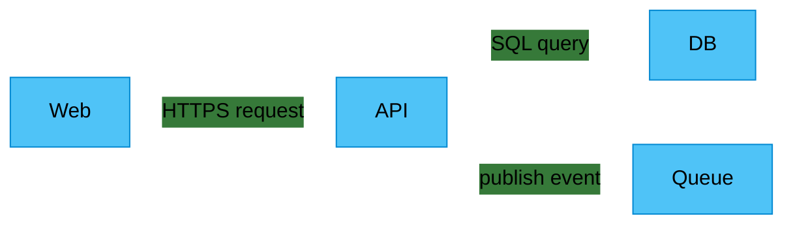

### Avoid Clever Syntax

> [!TIP]
> Mermaid can do many things. That does not mean every article needs them. Favor syntax that a future maintainer can understand quickly.


### Quote Labels When Needed

> [!TIP]
> If a label contains characters that confuse Mermaid, wrap it in quotes.
> 
> this code:
> 
> ```text
> flowchart TD
>     A["User clicks /checkout"] --> B["POST /api/orders"]
> ```
> 
> Is producing diagram:
> 
> ```mermaid
> %%{init: {'theme': 'base', 'themeVariables': { 'primaryColor': '#81c784', 'primaryTextColor': '#000', 'primaryBorderColor': '#388e3c', 'secondaryColor': '#aed581', 'tertiaryColor': '#f1f8e9', 'darkMode': true, 'lineColor': '#ffffff', 'signalColor': '#ffffff', 'signalTextColor': '#ffffff', 'textColor': '#ffffff', 'titleColor': '#ffffff', 'pieLegendTextColor': '#ffffff', 'pieTitleTextColor': '#ffffff', 'pieStrokeColor': '#ffffff', 'gridColor': '#ffffff', 'tickColor': '#ffffff', 'taskTextColor': '#000000', 'noteTextColor': '#000000', 'attributeTextColor': '#ffffff' }}}%%
flowchart TD
>     A["User clicks /checkout"] --> B["POST /api/orders"]
> ```
> 
> This is a small habit that prevents annoying rendering failures.


### Think About Dark Mode

> [!TIP]
> Many Hugo sites support dark mode. Make sure your Mermaid theme or site CSS keeps diagrams readable in both light and dark appearances.


## Common Mermaid Mistakes

### Mistake 1: Too Much Detail

> [!WARNING]
> Bad Mermaid diagrams often try to show every edge case. That makes them technically complete and practically unreadable. The fix is almost always the same: split the diagram into two or three smaller ones, each covering one concern, so readers can follow the logic without having to trace a dozen crossing arrows.


### Mistake 2: Long Labels

> [!WARNING]
> Long labels create wide boxes and ugly layouts.
> 
> Instead of this code:
> 
> ```text
> flowchart TD
>     A[The user submits the registration form with their email address and password]
> ```
> 
> Is producing diagram:
> 
> ```mermaid
> %%{init: {'theme': 'base', 'themeVariables': { 'primaryColor': '#f48fb1', 'primaryTextColor': '#000', 'primaryBorderColor': '#d81b60', 'secondaryColor': '#ce93d8', 'tertiaryColor': '#f3e5f5', 'darkMode': true, 'lineColor': '#ffffff', 'signalColor': '#ffffff', 'signalTextColor': '#ffffff', 'textColor': '#ffffff', 'titleColor': '#ffffff', 'pieLegendTextColor': '#ffffff', 'pieTitleTextColor': '#ffffff', 'pieStrokeColor': '#ffffff', 'gridColor': '#ffffff', 'tickColor': '#ffffff', 'taskTextColor': '#000000', 'noteTextColor': '#000000', 'attributeTextColor': '#ffffff' }}}%%
flowchart TD
>     A[The user submits the registration form with their email address and password]
> ```
> 
> Prefer this code:
> 
> ```text
> flowchart TD
>     A[Submit registration form]
> ```
> 
> Is producing diagram:
> 
> ```mermaid
> %%{init: {'theme': 'base', 'themeVariables': { 'primaryColor': '#ffb74d', 'primaryTextColor': '#000', 'primaryBorderColor': '#f57c00', 'secondaryColor': '#ffd54f', 'tertiaryColor': '#fff8e1', 'darkMode': true, 'lineColor': '#ffffff', 'signalColor': '#ffffff', 'signalTextColor': '#ffffff', 'textColor': '#ffffff', 'titleColor': '#ffffff', 'pieLegendTextColor': '#ffffff', 'pieTitleTextColor': '#ffffff', 'pieStrokeColor': '#ffffff', 'gridColor': '#ffffff', 'tickColor': '#ffffff', 'taskTextColor': '#000000', 'noteTextColor': '#000000', 'attributeTextColor': '#ffffff' }}}%%
flowchart TD
>     A[Submit registration form]
> ```
> 
> Explain details in the paragraph below the diagram.


### Mistake 3: Unclear Direction

> [!WARNING]
> Pick a direction and stick with it. Most process diagrams should use TD. Most architecture diagrams are easier with LR.


### Mistake 4: Treating Mermaid as a Design Tool

> [!WARNING]
> Mermaid is not Figma. It is not meant for pixel-perfect diagrams, and trying to force it into that role will only lead to frustration. Its strength is maintainability, not visual perfection — and that trade-off is intentional.


## Mermaid SEO Tips for Technical Blogs

Mermaid diagrams can make technical articles more useful, but search engines still need text. Do not rely on diagrams alone.

For SEO-friendly Mermaid articles:

- Use descriptive H2 and H3 headings.

- Explain each diagram in nearby text.

- Include the important keywords in normal prose.

- Keep code examples copyable.

- Add alt-style explanation below complex diagrams.

- Use concise front matter title and description.

- Avoid hiding all meaning inside the rendered SVG.

A Mermaid diagram should support the article. It should not be the only place where important information exists.

## Copy-Paste Mermaid Examples

### API Request Flow

this code:

```text
sequenceDiagram
    participant Client
    participant API
    participant Auth
    participant DB

    Client->>API: GET /account
    API->>Auth: Validate token
    Auth-->>API: Token valid
    API->>DB: Load account
    DB-->>API: Account data
    API-->>Client: 200 OK
```

Is producing diagram:

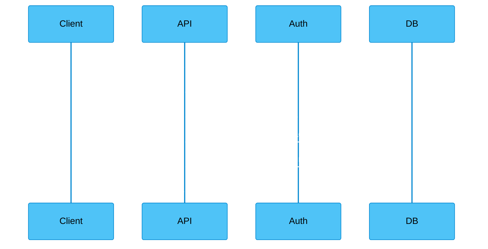

### CI Pipeline

this code:

```text
flowchart TD
    A[Push commit] --> B[Install dependencies]
    B --> C[Run lint]
    C --> D[Run tests]
    D --> E[Build site]
    E --> F[Deploy]
```

Is producing diagram:

```mermaid
%%{init: {'theme': 'base', 'themeVariables': { 'primaryColor': '#81c784', 'primaryTextColor': '#000', 'primaryBorderColor': '#388e3c', 'secondaryColor': '#aed581', 'tertiaryColor': '#f1f8e9', 'darkMode': true, 'lineColor': '#ffffff', 'signalColor': '#ffffff', 'signalTextColor': '#ffffff', 'textColor': '#ffffff', 'titleColor': '#ffffff', 'pieLegendTextColor': '#ffffff', 'pieTitleTextColor': '#ffffff', 'pieStrokeColor': '#ffffff', 'gridColor': '#ffffff', 'tickColor': '#ffffff', 'taskTextColor': '#000000', 'noteTextColor': '#000000', 'attributeTextColor': '#ffffff' }}}%%
flowchart TD
    A[Push commit] --> B[Install dependencies]
    B --> C[Run lint]
    C --> D[Run tests]
    D --> E[Build site]
    E --> F[Deploy]
```

This pattern maps naturally to a real CI configuration. For the step-by-step syntax of GitHub Actions workflows, the [GitHub Actions Cheatsheet](https://www.glukhov.org/developer-tools/ci-cd/github-actions-cheatsheet/) is a handy companion when you want to turn the diagram above into a working pipeline.

### Publishing Workflow

this code:

```text
stateDiagram-v2
    [*] --> Draft
    Draft --> Editing
    Editing --> Review
    Review --> Published
    Review --> Editing
    Published --> [*]
```

Is producing diagram:

```mermaid
%%{init: {'theme': 'base', 'themeVariables': { 'primaryColor': '#f48fb1', 'primaryTextColor': '#000', 'primaryBorderColor': '#d81b60', 'secondaryColor': '#ce93d8', 'tertiaryColor': '#f3e5f5', 'darkMode': true, 'lineColor': '#ffffff', 'signalColor': '#ffffff', 'signalTextColor': '#ffffff', 'textColor': '#ffffff', 'titleColor': '#ffffff', 'pieLegendTextColor': '#ffffff', 'pieTitleTextColor': '#ffffff', 'pieStrokeColor': '#ffffff', 'gridColor': '#ffffff', 'tickColor': '#ffffff', 'taskTextColor': '#000000', 'noteTextColor': '#000000', 'attributeTextColor': '#ffffff' }}}%%
stateDiagram-v2
    [*] --> Draft
    Draft --> Editing
    Editing --> Review
    Review --> Published
    Review --> Editing
    Published --> [*]
```

### Simple Data Model

this code:

```text
erDiagram
    AUTHOR ||--o{ POST : writes
    POST ||--o{ COMMENT : receives

    AUTHOR {
        string id
        string name
    }

    POST {
        string id
        string title
        datetime published_at
    }

    COMMENT {
        string id
        string body
    }
```

Is producing diagram:

```mermaid
%%{init: {'theme': 'base', 'themeVariables': { 'primaryColor': '#ffb74d', 'primaryTextColor': '#000', 'primaryBorderColor': '#f57c00', 'secondaryColor': '#ffd54f', 'tertiaryColor': '#fff8e1', 'darkMode': true, 'lineColor': '#ffffff', 'signalColor': '#ffffff', 'signalTextColor': '#ffffff', 'textColor': '#ffffff', 'titleColor': '#ffffff', 'pieLegendTextColor': '#ffffff', 'pieTitleTextColor': '#ffffff', 'pieStrokeColor': '#ffffff', 'gridColor': '#ffffff', 'tickColor': '#ffffff', 'taskTextColor': '#000000', 'noteTextColor': '#000000', 'attributeTextColor': '#ffffff' }}}%%
erDiagram
    AUTHOR ||--o{ POST : writes
    POST ||--o{ COMMENT : receives

    AUTHOR {
        string id
        string name
    }

    POST {
        string id
        string title
        datetime published_at
    }

    COMMENT {
        string id
        string body
    }
```

## When Not to Use Mermaid

Do not use Mermaid when:

- The diagram needs precise visual layout.

- The design must match a brand system exactly.

- The visual is mostly decorative.

- The diagram has too many nodes to read.

- A screenshot would explain the point better.

- The content changes rarely and needs polish more than maintainability.

Mermaid is excellent for living technical documentation. It is less good for presentation-grade artwork. For document-quality diagrams in print or PDF contexts, LaTeX offers packages like TikZ and pgfplots that give you far greater layout control — the [LaTeX Cheat Sheet](https://www.glukhov.org/documentation-tools/latex/latex-cheat-sheet/) covers diagram inclusion alongside the rest of the LaTeX toolkit.

## Final Thoughts

Mermaid is one of the best tools for technical blogging because it respects how developers already work: text files, Markdown, Git, code review, and repeatable builds. For everything around the diagrams — headings, lists, tables, code blocks — the [Markdown Cheatsheet](https://www.glukhov.org/documentation-tools/markdown/markdown-cheatsheet/) is the quick-reference companion to keep alongside this guide.

The best Mermaid diagrams are not the most complex ones. They are the diagrams that make a concept obvious and remain easy to edit six months later.

Use Mermaid for the diagrams that should live with your documentation. Keep them small, keep them readable, and treat them as part of the source code of your article.